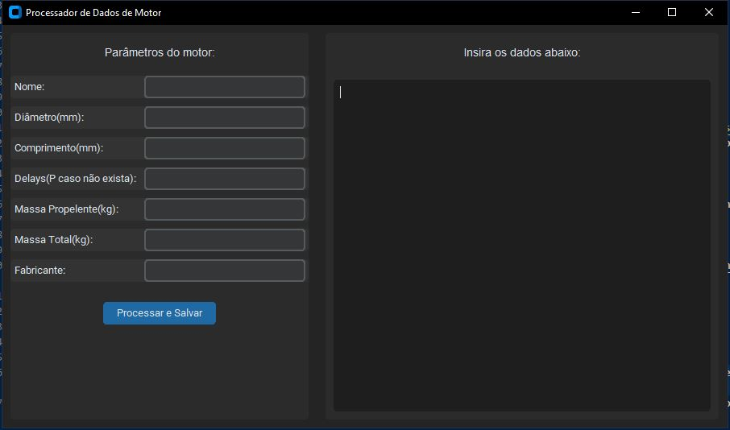
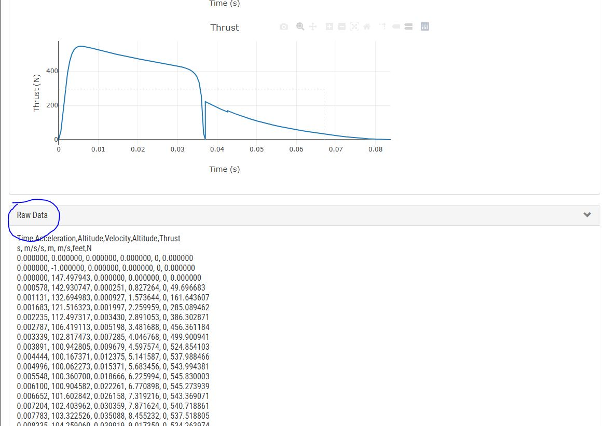
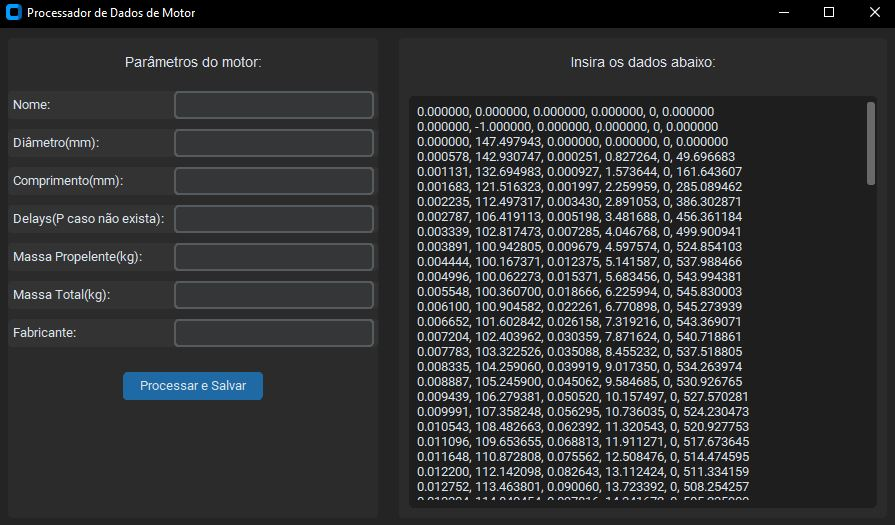

<h3 align="center">Motor Agua</h3>
<p align="center">Algoritmo com objetivo de converter os valores da curva de empuxo obtidos no site do AirCommand para arquivo .eng, compatível com o software OperRocket.</p>

## introdução



Com interface simples, a tarefa de simular os lançamentos torna-se mais fácil.

## Requisitos
<p>Para executar o arquivo ,é necessário ter o python instalado, onde pode ser facilmente adquirido <a href="https://www.python.org/downloads/">neste link</a>.</p>
<p>Após a intalçacao , é necessario baixar a biblitoeca CustomTkinter para a interface, o qual pode ser obtido a partir do comando:</p>
```cmd
pip3 install customtkinter
```
<p>Com isso instalado já será possível executar o codigo, que pode ser feito utilizando o interpretador baixado anteriormente.</p>

## Uso

<p>Para utilizar o programa, primeiro entre no site <a href="http://www.aircommandrockets.com/sim/simulator.htm">http://www.aircommandrockets.com/sim/simulator.htm</a> e simule um foguete com as caracteristicas desejadas.</p>
<p>Após simular o foguete, vá para a a parte inferior do site e clicke em "Raw Data".</p>

<p>Copie todos os números , e ignore a primeira e segunda linha.</p>
<p>Cole os dados copiados na área indicada.</p>

após colar, complete as lacunas do lado direito de acordo com as caracteristicas do motor, mais detalhes de como esse tipo de arquivo funciona pode ser encontrado <a href="https://www.thrustcurve.org/info/raspformat.html">neste site</a>.
<p>com o arquivo gerado pelo programa, podemos simular o lançamento do foguete utilizando o OpenRocket, basta importa-lo, mais instruções podem ser encontrados <a href="https://openrocket.info/tutorials/motor-selection.html#adding-your-own-motor-files">aqui</a>.</p>

